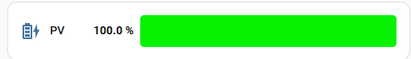
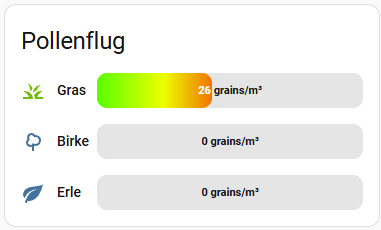

# Dynamic Bar Card for Home Assistant


A highly customizable, responsive, and dynamic progress bar card for Home Assistant's Lovelace UI. Designed to display values beautifully with color thresholds, custom gradients, drag & drop sorting, and full visual editor support.

## Features

- **Multiple Entities**: Display multiple progress bars in a single card, either stacked vertically or side-by-side horizontally.
- **Dynamic Colors & Gradients**: Define colors based on entity values. Support for smooth gradients or hard steps.
- **Full Visual Editor Support**: Easily configure everything directly in the Home Assistant UI. Includes an intuitive drag & drop interface for sorting entities.
- **Highly Customizable Layouts**:
  - Horizontal or vertical orientation.
  - Position icons and names above or inline with the bar.
  - Flexible positioning of the actual value (inside the bar, below the name, next to the bar, etc.).
- **Internationalization (i18n)**: Out-of-the-box support for multiple languages (English and German included). Automatically adapts to your Home Assistant user profile settings.
- **Independent Color Modes**: Configure icon colors to follow your theme (default), match the dynamic bar color, or use a static color.

## Screenshots




## Installation

### HACS (Recommended)

[](https://my.home-assistant.io/redirect/hacs_repository/?owner=Tabu1973&repository=dynamic-bar-card&category=plugin)

1. Open HACS in Home Assistant.
2. Go to "Frontend".
3. Click the 3 dots in the top right corner and select **Custom repositories**.
4. Add the URL of this repository: `https://github.com/Tabu1973/dynamic-bar-card`
5. Select **Dashboard** as the category and click Add.
6. Install the **Dynamic Bar Card**.
7. (Optional but recommended) Refresh your browser cache.

### Manual Installation

1. Download the `dynamic-bar-card.js` file from the latest release.
2. Copy the file into your `<config>/www/` folder.
3. Add the resource to your Home Assistant dashboard:
   - Go to Settings -> Dashboards -> Click the 3 dots in the top right -> Resources.
   - Add `/local/dynamic-bar-card.js` as a **JavaScript Module**.
4. Refresh your browser cache.

## Configuration

We highly recommend using the Visual Editor in Home Assistant to configure this card, as it provides a preview and allows easy Drag & Drop reordering of entities.

However, if you prefer YAML, here is an example:

```yaml
type: custom:dynamic-bar-card
title: Pollen Count
layout_direction: horizontal
label_position: above
label_width: 30%
value_position: outside
outside_position: right
entities:
  - entity: sensor.birch_pollen
    name: Birch
    icon: mdi:tree
    icon_color_mode: dynamic
    min: 0
    max: 100
    bar_height: 12
    border_radius: 6
    gradient_type: smooth
    colors:
      - value: 0
        color: '#4caf50'
      - value: 30
        color: '#ffeb3b'
      - value: 70
        color: '#f44336'
```

## License

This project is licensed under the MIT License - see the [LICENSE](LICENSE) file for details.

## Acknowledgments

* Built with [Lit](https://lit.dev/) (specifically `LitElement`), which is bundled with Home Assistant.
* Inspired by the wonderful Home Assistant custom card community.
